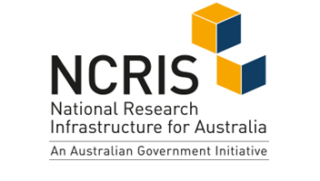
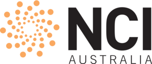

## Quick access links

[Request New Project](https://docs.google.com/forms/d/e/1FAIpQLSf9UVEuhbAsbvVzTEvvE9mLoietryb7e3sDmv74Xhl-1YWj2Q/viewform?usp=sf_link){: class="btn btn-primary col-3"}
[Request Additional Resources](https://docs.google.com/forms/d/e/1FAIpQLSfzHJajEKTnGuYWb1gLRR2nlUExLIRM7qSGy_hhbiCKB3KX2Q/viewform?usp=sf_link){: class="btn btn-primary col-3"}
[Request Software Installation](https://docs.google.com/forms/d/e/1FAIpQLScpiyqERdxw6gMxjlq_CkiI3qvJ60YaeWHKTJChMjcnv8aBBA/viewform?usp=sf_link){: class="btn btn-primary col-3"}

[Request Help](https://docs.google.com/forms/d/e/1FAIpQLSere1PvgPEuJkpvQUk1-11C88IAeQNQKEUFc-Qgbn5GgKK2jw/viewform?usp=sf_link){: class="btn btn-primary col-3"}
[Report Project Outcome](https://docs.google.com/forms/d/e/1FAIpQLSdO1w-RY8OexUBwJx8BHNMwSRNPA3_-5r6pefdQW8ancbKZqw/viewform?usp=sf_link){: class="btn btn-primary col-3"}
[Available Tools](/ables/resources/#shared-repository-of-tools-and-software){: class="btn btn-primary col-3"}

## About ABLeS

ABLeS is an [Australian Biocommons](https://www.biocommons.org.au/) program that aims to grow and simultaneously accelerate 
the capacity of life science communities  to construct, maintain and gain insights from 
community-defined and developed data assets (e.g. reference genome assemblies). 
ABLeS provides these communities with access to the tailored mix of infrastructure and 
computational resources that is necessary to create these assets. 

ABLeS communities broadly align with the following three principles:

1. They are a defined community that are focused on a common research theme
2. There exists a community-led prioritisation and decision making mechanism (e.g. a steering committee) to prioritise bioinformatics work using relevant computational resources, and
3. The community has expertise which will drive and execute its bioinformatics agenda.

ABLeS is supported by resources at the [National Computational Infrastructure (NCI)](https://nci.org.au/) and [Pawsey Supercomputing Centre](https://pawsey.org.au/). ABLeS support includes infrastructure resources such as high performance computing (HPC), cloud and storage, as well as specialist expertise from the NCI, Pawsey and the ABLeS support team.

More details are available in the ABLeS publication:

> **Manos, Steven, Gustafsson, Ove Johan Ragnar, Al Bkhetan, Ziad, & Francis, Rhys.** (2022). *Building community data assets for life sciences through ABLeS - the Australian BioCommons Leadership Share (1.0).* Zenodo. [https://doi.org/10.5281/zenodo.6342352](https://doi.org/10.5281/zenodo.6342352)

  

<strong><em>ABLeS is co-funded by <a href="https://bioplatforms.com/biocommons/">Bioplatforms Australia</a> (enabled by <a href="https://www.dese.gov.au/ncris">NCRIS</a>), <a href="https://nci.org.au/">the National Computational Infrastructure (NCI)</a> and <a href="https://pawsey.org.au/">Pawsey Supercomputing Research Centre</a>.
</em></strong>

  
  
  
  

