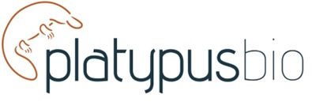

## Project title

Metagenome-informed discovery, development and optimization of genome editing solutions.

## Contact(s)

- Simon Jackson simon.jackson@platypusbio.com

{: style="display: block; margin-left: auto; margin-right: auto;"}

## Project description and aims

PlatypusBio specialise in the identification and development of new molecular
tools to enhance and expand the genomics-based therapeutic toolkit. In
partnership with Bioplatforms Australia, the Australian BioCommons ABLeS
scheme enables us to search for and unlock the vast molecular potential of
untapped microbes around the globe. From nature to sequence to therapies,
our vision is to support new and alternate therapeutic approaches in the
precision genomics era.

## How is ABLeS supporting this work?

This work is supported through the production bioinformatics scheme provided by ABLeS. The supports includes 1 TB temprary storage, 5 TB long term storage and 100 KSUs per quarter.

 

> _These details have been provided by project members at project initiation. For more information on the project, please consult the contact(s) or project links above._
