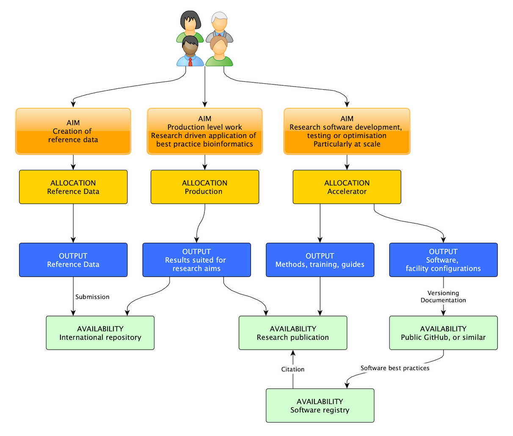

## ABLeS process for different stages of a project's lifetime

The Australian BioCommons and the bioinformatics leads for each group have different roles in initiation, onboarding and reporting for ABLeS. 

ABLeS projects are led and maintained by their users with the support of the ABLeS team to facilitate access to ABLeS resources. 

If you are new to the ABLeS program, please read the processes below in order to start using ABLeS resources or **[contact us](contact-us.md)** for more information and assistance. 

      

        <h2 class="accordion-header" id="heading-process-1" style="margin-top:0rem">
          <button class="accordion-button collapsed" type="button" data-bs-toggle="collapse" data-bs-target="#collapse-process-1" aria-expanded="false" aria-controls="collapse-process-1">
            Setting up an ABLeS project
          </button>
        </h2>
        

          

          <b>Project bioinformatics lead role:</b>
          <ol>
            <li>Familarise themselves with ABLeS schemes, expectations, and responsibilities.</li>
            <li>Submit a project plan that contains the details of the project (<a href="https://docs.google.com/forms/d/e/1FAIpQLSf9UVEuhbAsbvVzTEvvE9mLoietryb7e3sDmv74Xhl-1YWj2Q/viewform?usp=sf_link">link</a>). The community’s steering committee should approve the plan.</li>
            <li>Identify known existing challenges, that BioCommons, NCI, or Pawsey may be able to address and / or support as part of ABLeS. You can use the GoogleForm to let us know about these challenges.</li>
          </ol> 
          <b>The Australian BioCommons role:</b>
          <ol>
            <li>Creation of a project allocation at the NCI for a community</li>
            <li>Inviting community bioinformatics leads to a project allocation as Chief Investigators</li>
            <li>Providing information on how to utilise ABLeS resources and contribute to the shared tool and software repository.</li>
            <li>BioCommons manage the resources available to the ABLeS programme across all active projects.</li>
          </ol>
          

        

      

      

        <h2 class="accordion-header" id="heading-process-2" style="margin-top:0rem">
          <button class="accordion-button collapsed" type="button" data-bs-toggle="collapse" data-bs-target="#collapse-process-2" aria-expanded="false" aria-controls="collapse-process-2">
            During ABLeS project
          </button>
        </h2>
        

          

          <b>Project bioinformatics lead role:</b>
          <ol>
            <li>Request additional resources (<a href="https://docs.google.com/forms/d/e/1FAIpQLSfzHJajEKTnGuYWb1gLRR2nlUExLIRM7qSGy_hhbiCKB3KX2Q/viewform?usp=sf_link">link</a>) when the project needs more resources than are available. Each project gets <a href="ables/resources">default resources</a> automatically at the beginning of each quarter without the need to request them.</li>
            <li>Attend a quarterly meeting with BioCommons to discuss and report the outcomes of the community work (data, methods, publications..) in the previous quarter.</li>
            <li>Project bioinformatics leads manage the resources provided by ABLeS including:
              <ul>
                <li>Adding members to the projects.</li>
                <li>Educating / onboarding new members on ABLeS projects.</li>
                <li>Contributing and / or coordinating contributions to the shared tool and software repository (if89), as well as encouraging community contribution.</li>             
              </ul>
            </li>
          </ol>
          <b>Project members role:</b>
          <ol>
            <li>Try their best to utilise ABLeS resources efficiently and use the resource for the project purposes</li>
            <li>Help to deploy and install software, tools and workflows to the shared repository (this activity may be coordinated by the project bioinformatics leads, as needed)</li>
          </ol>
          <b>The Australian BioCommons role:</b> Biocommons helps communities to overcome different challenges that may appear:
          <ol>
            <li>Installing tools, software, pipelines when a special support is needed. </li>
            <li>Optimising workflows and software to be used by all projects.</li>
            <li>Developing and improving cross-cutting tools and workflows.</li>
            <li>Managing the allocation of resources for projects and add default resources at the begining of each quarter.</li>
          </ol>
          We realise that communities will have different capabilities and different needs. Therefore, ABLeS support will adapt to suit these aspects and aim to provide the best possible support to the communities in order to do their work efficiently.
          

        

      

      

        <h2 class="accordion-header" id="heading-process-3" style="margin-top:0rem">
          <button class="accordion-button collapsed" type="button" data-bs-toggle="collapse" data-bs-target="#collapse-process-3" aria-expanded="false" aria-controls="collapse-process-3">
            Closing an ABLeS project
          </button>
        </h2>
        

          

          <b>Project bioinformatics lead role:</b>
          <ol>
            <li>Notify the AUstralian BioCommons when you are ready to close your project.</li>
            <li>Make sure all project data is archived as the project storage will be released.</li>
            <li>Make sure all workflows are registered at <a>workflowhub</a> and well documented so they are findable.</li>
            <li>Report the project outcomes to the Australian BioCommons.</li>
          </ol>
          <b>The Australian BioCommons role:</b>
          <ol>
            <li>Finalise the closing process with the infrastrucure provider. </li>
          </ol>
          

        

      

## Pathways within the Australian BioCommons Leadership Share (ABLeS)

<table class="tg">
<thead>
  <tr>
    <th class="tg-kcp5" rowspan="2">Principle</th>
    <th class="tg-kcp5" rowspan="2">Characteristics of an ABLeS project</th>
    <th class="tg-kcp5" colspan="3">Project Type</th>
  </tr>
  <tr>
    <th class="tg-7o2y">Reference Data</th>
    <th class="tg-7o2y">Production bioinformatics</th>
    <th class="tg-7o2y">Software Accelerator</th>
  </tr>
</thead>
<tbody>
  <tr>
    <td class="tg-baqh">Data centric outcomes</td>
    <td class="tg-0lax">It is producing reference and derived data assets that will be published to enable use / reuse by others outside the community.</td>
    <td class="tg-ibb5">Yes</td>
    <td class="tg-ibb5">Yes</td>
    <td class="tg-baqh"></td>
  </tr>
  <tr>
    <td class="tg-baqh">Research centric outcomes</td>
    <td class="tg-0lax">It is producing data assets and outputs that are critical to research projects and consortia making use of best practice production level bioinformatics approaches.</td>
    <td class="tg-baqh"></td>
    <td class="tg-ibb5">Yes</td>
    <td class="tg-baqh"></td>
  </tr>
  <tr>
    <td class="tg-baqh">Software centric outcomes</td>
    <td class="tg-0lax">It is creating, developing, installing, testing and/or optimising software that will be made available for use / reuse by others in the life science community.</td>
    <td class="tg-baqh"></td>
    <td class="tg-baqh"></td>
    <td class="tg-ibb5">Yes</td>
  </tr>
  <tr>
    <td class="tg-baqh">Common research theme</td>
    <td class="tg-0lax">It is a defined cross-institutional collaboration, project, community, consortium, or some other collaborative construct, that is focused on a common research theme.</td>
    <td class="tg-ibb5" colspan="3">Yes</td>
  </tr>
  <tr>
    <td class="tg-baqh">Development & optimisation</td>
    <td class="tg-0lax">Communities work to understand their software, methods and the optimal approaches to solving the bioinformatics problems at hand. ABLeS will facilitate both the experimental / testing and production phases of computational analyses.</td>
    <td class="tg-ibb5" colspan="3">Yes</td>
  </tr>
  <tr>
    <td class="tg-baqh">Planned usage of ABLeS resources</td>
    <td class="tg-0lax">The use of ABLeS resources is planned and approached with a level of care appropriate to their status as limited and consumable resources.</td>
    <td class="tg-ibb5" colspan="3">Yes</td>
  </tr>
  <tr>
    <td class="tg-baqh">Sharing</td>
    <td class="tg-0lax">Appropriate mechanisms are used to share outputs that support and assist other communities, with examples provided in Table 3. Outputs include software, methods, training, resource usage and quality assessments for derived reference data sets, submissions to data international repositories and research publications.</td>
    <td class="tg-ibb5" colspan="3">Yes</td>
  </tr>
</tbody>
</table>

 
Considering the three schemes supported by ABLeS (Creation of reference data assets, Production analysis, and Bioinformatics software accelerator), ABLeS users will follow one of the paths demonstrated below. 

{: height="85%" width="80%"  style="display: block; margin-left: auto;  margin-right: auto;"}

## ABLeS Expectations

|Principle| Description|
|-------------|------------------------------------------------------------------|
|**Project leadership**| A project lead is responsible for all use of resources provided, which will need to adhere to relevant facility processes and policies. The lead will also monitor and manage reasonable usage of their project computational infrastructure allocations.|
|**Community-level decision making**| There exists a collaborative decision making mechanism to prioritise the bioinformatics work using relevant computational resources. This can be a formalised steering committee, a working group, or some other forum which is representative of the collaboration. Resources used must be agreed upon / in line with the community’s decision making mechanism and align with community priorities.|
|**Community-level expertise**|The community has expertise which will drive and execute its bioinformatics agenda. This expertise offers a strong collaboration link with the expertise and support available through ABLeS, NCI and Pawsey.|
|**Collaboration & consultation**|ABLeS is collaborative and involves the BioCommons, the research community, and the computational facilities. It is also a standing item for discussion and forums play a strong role in managing the use of ABLeS: communities will thus engage the BioCommons in an open and collaborative manner, with regular meetups.|
|**Follow compute facility access policies**|All users must abide by the relevant access policies of Pawsey and NCI. NCI Terms and Conditions of Access; NCI Data Collections Management; and Pawsey Conditions of Access.|
|**Time frame / duration of allocations**|Each project is reviewed at the 6 month mark, to ensure resources are being used as efficiently as practical and so challenges can be identified / addressed by the ABLeS team. Reference data and production projects are by definition on-going, while software accelerator projects need to be renewed at 6 months if the work originally described for the project has not been completed.|

